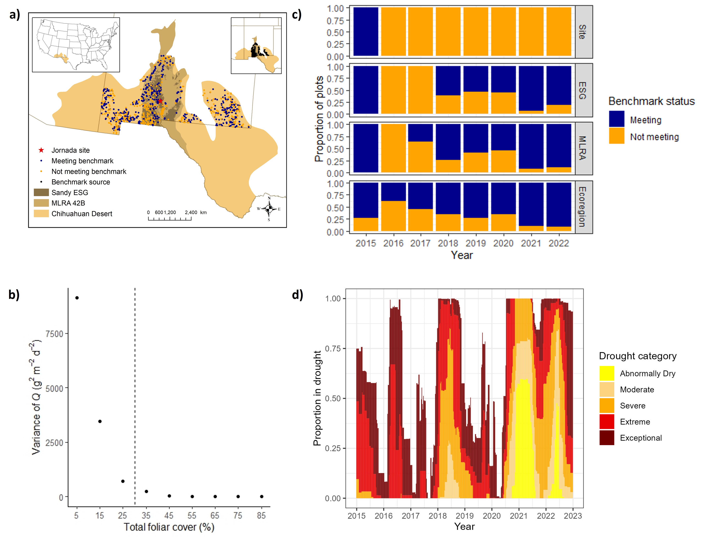

```{r setup, include=FALSE}
knitr::opts_chunk$set(echo = TRUE)
```

## Overview

Now we will use all of the skills we have learned in this workshop in a real world case study. This example walks through using R and publicly available datasets to examine how drought is influencing wind erosion in the Chihuahuan Desert. Our goal is to reproduce Figure 4 from McCord et al. 2024 (***https://doi.org/10.1002/ael2.20120***). First, we will query the Landscape Data Commons for data that fall within the Chihuahuan Desert ecoregion. Then, we will use these data to set a benchmark of expected wind erosion risk in the Chihuahuan Desert. With this benchmark in place, we will apply it to the monitoring data in the Landscape Data Commons and compare those results at multiple spatial scales. Finally, we will incorporate drought and remote-sensing based fractional cover data (***FOR ERIC, Bare ground from RAP could be cool here***), to provide additional context to the field based monitoring data.


Library the packages we will use in this demo
```{r}
library(trex) # for fulling data on the Landscape Data Commons
library(sf) 
library(ggplot2) # for data visualization
library(viridis) # colorblind friendly color palettes
```

## 1. Prepare Data
Make sure your working directory is set for Part2 of this workshop, for example: setwd("C:/Users/gharrison/OneDrive - USDA/Documents/R scripts/RinRange_workshop_srm24/Part2")

Now we need to pull in some polygons for our region of interest so that we can set a spatial boundaries on our data.  
*GH will come back and change the fetch edit command so that these data are already downloaded*
```{r}
# get polygons
chihuahuan_desert <- read_sf("MapLayers/ChihuahuanDesert.shp")
nm <- read_sf("MapLayers/NewMexico_Albers.shp")
sandy_esg <- read_sf("MapLayers/SandyESG.shp")

# extract data from LDC
data <- fetch_ldc_spatial(chihuahuan_desert,
                          data_type = "indicators")

header <-fetch_ldc(data_type = "header")
```

## 2. Establish benchmark
*add a description of these benchmark points - where did they come from and what will we be using them for?*
``` {r}
# get benchmark data
benchmark <- read.csv("benchmark_points.csv")

head(benchmark)
```

## 3. Apply benchmark
*GH come back and break this code up into more lines to better explain what is going on*
*GH come back and add info about CRS*
``` {r}
# note if data have been used in benchmarking

# subset data to only include rows where Longitude values are not missing 

# add a new column to the benchmark data frame based on the value in PrimaryKey Key values. If PrimaryKey are in the benchmark dataset, then value is set to "benchmark", otherwise they value is set to 'new'

# converts Long and Lat values to numeric

data <- data |> subset(!is.na(Longitude_NAD83)) |> 
  dplyr::mutate(benchmark =
                  dplyr::case_when(PrimaryKey %in% benchmark$PrimaryKey~ "benchmark",
                                   !PrimaryKey %in% benchmark$PrimaryKey~ "new")
                ) |> 
  dplyr::mutate(Longitude_NAD83 = as.numeric(Longitude_NAD83),
                Latitude_NAD83 = as.numeric(Latitude_NAD83)) 
# save these data as a csv - this will automatically save to your working directory
write.csv(data, "ldc_data.csv")

#
# convert to spatial
# move from a st to sf object
# users must specify the columns which are coordinates, and the Coordinate reference system
## TO DO Georgia come back and add links for CRS
data_sf <- sf::st_as_sf(data %>% subset(!is.na(Longitude_NAD83)),
                     coords = c("Longitude_NAD83", "Latitude_NAD83"),
                     crs = st_crs(chihuahuan_desert))
# save these data as a shapefile
sf::st_write(data_sf, "ldc_data.shp", append=F) 


```

***Potentially drop this section***

For management purposes, we are going to focus on the NM portion of the Chihuahuan Desert.
``` {r}

#TODO Nelson, could you help me make this intersection work? I think I moved to R because it wasn't going well in R
# work with intersected data
nm_data <- sf::st_read("~/Papers/DataCommons/AEL_submission/R2/Vignette/ldc_data_nm_intersect.shp")

nm_data <- nm_data |> dplyr::mutate(NWERN_JER = dplyr::case_when(PrjctKy %in% "NWERN_JER"~ "yes"),
                                    Chihuahuan_desert = "yes",
                                    DateVisited = lubridate::as_date(DatVstd),
                                    Year = lubridate::year(DateVisited) |> as.factor(),
                                    # benchmark points
                                    evaluated = dplyr::case_when(TtlFlrC >30 ~ "Meeting",
                                                                 TtlFlrC <=30 ~ "Not meeting"
                                                                 )
)

nm_data_long <- as.data.frame(nm_data) |>
  tidyr::pivot_longer(cols = c("MLRA42","SandyESG", "NWERN_JER", "Chihuahuan_desert"),
                      names_to = "region",
                      values_to = "region_membership") |>
  subset(region_membership =="yes")|>
  dplyr::mutate(region = factor(region)|>
                  dplyr::recode( "NWERN_JER" = "Site",
                                 "SandyESG" = "ESG",
                                 "MLRA42" = "MLRA",
                                 "Chihuahuan_desert" = "Ecoregion"))

nm_data_long$region <- factor(nm_data_long$region,
                              levels = c( "Site", "ESG",
                                          "MLRA","Ecoregion")
                              )
```

### Plot the results

``` {r}
# box plot
ggplot(nm_data_long |> subset(bnchmrk== "new" &
                                Year %in% c("2015", "2016", "2017", "2018", "2019", "2020", "2021", "2022") &
                                TtlFlrC),
       aes(x = Year,
                                                                   y = TtlFlrC,
                                                                   group = Year)) +
  facet_grid(rows = "region")+
  geom_boxplot()+
  geom_point(aes(color = evaluated))+
  scale_color_manual(values = c("darkblue", "orange"))+
  theme_bw()+
  ylab("Total foliar cover (%)")+
  guides(color=guide_legend(title="Benchmark status"))

# bar chart
ggplot(nm_data_long |> subset(bnchmrk== "new" &
                                Year %in% c("2015", "2016", "2017", "2018", "2019", "2020", "2021", "2022") &
                                TtlFlrC),
       aes(x = Year,
           y = TtlFlrC,
           fill = evaluated)) +
  facet_grid(rows = "region")+
  geom_bar(position = "fill", stat = "identity")+
  scale_fill_manual(values = c("darkblue", "orange"))+
  theme_bw()+
  ylab("Proportion of plots")+
  guides(fill=guide_legend(title="Benchmark status"))

# summarize
nm_data_summary <- nm_data_long |> subset(bnchmrk== "new" &
                         Year %in% c("2015", "2016", "2017", "2018", "2019", "2020", "2021", "2022") &
                         TtlFlrC) |>
  dplyr::select(PrmryKy, region, Year) |>
  dplyr::mutate(Year = as.character(Year)) |>
  dplyr::distinct()|>
  dplyr::group_by(Year, region) |> dplyr::tally()
```

## 4. Climate Data/RAP

```{r}
## get climate data
# join county area to US Drought Monitor
county <- read.csv("County_area.csv")
USDM <- read.csv("USDM_20150101_20221231.csv")

# summarize
USDM_summary <- USDM |> dplyr::group_by(MapDate) |>
  dplyr::summarise(
    None = sum(None),
    D0 = sum(D0),
    D1 = sum(D1),
    D2 = sum(D2),
    D3 = sum(D3),
    D4 = sum(D4)
  )|> tidyr::pivot_longer(cols = c(None:D4),
                          names_to = "Drought_Category",
                          values_to = "SQMI") |>
  dplyr::mutate(Drought_percent = SQMI/58180,
                MapDate = as.Date(as.character(MapDate),format = "%Y%m%d"))

USDM_extreme <- USDM_summary |> subset(Drought_Category %in% c("D3", "D4"))|>
  dplyr::group_by(MapDate)

usdm_color <- c("#ffff00", "#fcd37f", "#ffaa00", "#e60000", "#730000") %>% rev()
usdm_labels <- c("Exceptional", "Extreme", "Severe", "Moderate", "Abnormally Dry")

drought_plot <-ggplot(USDM_summary |> subset(!Drought_Category=="None" &
                                               MapDate < "2022-12-31"),
                      aes(x = MapDate, y = Drought_percent, fill = Drought_Category)) +
  geom_col()+
  scale_fill_manual(values = usdm_color,
                    labels = usdm_labels,
                    name = "Drought category",
                    guide = guide_legend(reverse = TRUE))+
  #scale_x_date(date_breaks = "years", date_labels = "%Y")+
  ylab("Proportion in drought") +
  xlab ("Year")+
  scale_x_date(date_breaks = "1 year",date_labels = "%Y")+
  theme_bw()

drought_plot
ggsave(drought_plot, filename = "ecoregion_drought.jpg")
```
