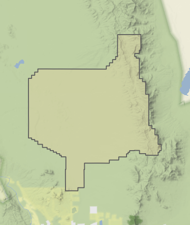
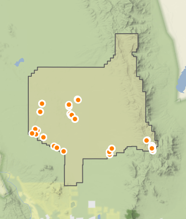

###########################
# TREX

**Accessing public data with trex (Terrestrial Rangeland data EXtraction)**
```{r trex_setup, include=FALSE}
knitr::opts_chunk$set(echo = TRUE, message = FALSE, warning = FALSE)

# We'll need these installed from CRAN
required_packages <- c("ggplot2", "sf", "remotes", "knitr", "kableExtra", "tidyverse")
install.packages(required_packages[!required_packages %in% installed.packages()])

# And trex if it isn't installed yet, make sure that it is
if (!"trex" %in% installed.packages()) {
  remotes::install_github(repo = "landscape-data-commons/trex")
}

# Attach these packages so we don't need to explicitly reference the namespaces
library(tidyverse)
library(terradactyl)

# We'll load up all the data we need for later
boundary_polygon <- sf::st_transform(x = sf::st_read(dsn = "trex",
                                                     layer = "jer_boundary"),
                                     crs = "+proj=longlat +ellps=GRS80 +no_defs")
```

## Overview
The package [*trex*](https://github.com/landscape-data-commons/trex) can be used to retrieve publicly-available data directly from the [Landscape Data Commons (LDC)](https://landscapedatacommons.org) and [Ecosystem Dynamics Interpretive Tool (EDIT)](https://edit.jornada.nmsu.edu) APIs. This lets you programmatically query either source from R without having to construct your own API calls. Use cases include pulling monitoring data from the LDC for an area of interest or a specific ecological site and retrieving ecological site properties associated with data.

### Landscape Data Commons (LDC)
The Landscape Data Commons is a repository for multiple ecological data sets including data from the Bureau of Land Management (BLM) Assessment, Inventory, and Monitoring program ([AIM](https://www.blm.gov/aim)) and the Natural Resources Conservation Service ([NRCS](https://www.nrcs.usda.gov/)) Landscape Monitoring Framework (LMF). These are "raw" data from the field which have undergone quality control measures and are suitable for deriving ecological indicators, e.g., percent foliar cover or average sagebrush height.

### Ecosystem Dynamics Interpretive Tool (EDIT)
EDIT is a database containing Ecological Site Descriptions (ESDs) which define the properties associated with ecological sites. An ecological site is all the areas of a landscape which share geophysical and climatic properties and which produce similar kinds and amounts of vegetation. Knowing what ecological site a part of a landscape falls in can inform interpreting data from that area, e.g., having 10% of a location covered with vegetation means something very different on a steep, dry, gravelly slope than in a flat, loamy grassland.

## Querying the LDC
There are a few functions in *trex* which query the LDC, each of which is aimed at a different scenario. If you have a polygon or set of polygons and you want to retrieve data from sampling locations within them, you can use `fetch_ldc_spatial()`. If you want to retrieve data associated with one or more ecological sites, you can use `fetch_ldc_ecosite()`. For any other data retrieval, you can use the function that underpins those two, `fetch_ldc()`.

A critical reference for working with the LDC API is the [offical documentation](https://api.landscapedatacommons.org/api-docs). This lists the name of every data table you can query and the details of the variables each contains. You'll need this page in order to know for sure how to ask for data, especially if you're using `fetch_ldc()`.

### Retrieving data within a spatial extent using `fetch_ldc_spatial()`
The function `fetch_ldc_spatial()` was written to streamline querying the LDC using polygons. It compares your polygon(s) against the data locations and returns the requested data type associated with the locations falling within the polygon(s).

For this example, we'll use the Jornada Experimental Range (JER) in southern New Mexico, shown in the map below.

<br>



<br>

Because we've already loaded the JER boundary polygon as an sf polygon object using `sf::st_read()` and that's what `fetch_ldc_spatial()` expects, we can easily ask for data from within that polygon.
As a first example, we'll simply ask for the header table, which contains the most basic information about the sampling locations, importantly their PrimaryKeys (which are unique to each location) and their coordinates.

``` {r get_headers_spatial, warning=FALSE}
# The argument called polygons takes an sf polygon object while data_type takes
# the name of one of the tables that the LDC serves out.
# Note that the polygons are treated as a single unit, even if your object
# contained multiple or multipart polygons.
jer_headers <- trex::fetch_ldc_spatial(polygons = boundary_polygon,
                                       data_type = "header")
```
``` {r jer_header_table, echo=FALSE}
kableExtra::scroll_box(kableExtra::kable_styling(knitr::kable(x = head(jer_headers),
                                                              format = "html",
                                                              caption = "The first few rows of header results for the Jornada Experimental Range"),
                                                 bootstrap_options = "striped"),
                       height = "300px",
                       width = "100%")
```

<br>

The header table is nice, but is usually just a starting point or used specifically for map making. If you wanted to use the headers for anything spatial, you'd need to convert it into an sf points object.

``` {r headers_to_points}
# The function sf::st_as_sf() will convert a data frame that includes coordinates
# into an sf object.
# In this case, we have the coordinates in the North American Datum 1983 (NAD83)
# Coordinate Reference System so we'll tell it which variables have the latitude
# and longitude values and that the CRS code is 4269 (that is, NAD83)
jer_points <-  sf::st_as_sf(x = jer_headers,
                            coords = c("Longitude_NAD83",
                                       "Latitude_NAD83"),
                            crs = 4269)
```

<br>



<br>

However, the headers on their own aren't very useful. Luckily, we can also use `fetch_ldc_spatial()` to grab other kinds of data from the LDC associated with our polygon, including the already-computed standard AIM indicators and raw data from data collection methods like Line-Point Intercept, Gap Intercept, Soil Aggregate Stability, Vegetation Height, and Species Richness.

``` {r get_data_spatial, warning=FALSE}
# The LDC functions in trex can retrieve from only one data table at a time, so
# you'd need a different function call for each. This code will ask for the
# computed indicators.
jer_indicators <- trex::fetch_ldc_spatial(polygons = boundary_polygon,
                                          data_type = "indicators")

# And this will pull the raw LPI data that was used to compute the cover indicators
# that we just got in jer_indicators
jer_lpi <- trex::fetch_ldc_spatial(polygons = boundary_polygon,
                                   data_type = "lpi",
                                   # This argument asks the API to give the data
                                   # back in chunks of 5000 records at a time
                                   # so that we don't overwhelm the server, but
                                   # we'll still get all the data.
                                   take = 5000)
```
``` {r jer_indicator_table, echo=FALSE}
kableExtra::scroll_box(kableExtra::kable_styling(knitr::kable(x = head(jer_indicators),
                                                              format = "html",
                                                              caption = "The first few rows of indicator results for the Jornada Experimental Range"),
                                                 bootstrap_options = "striped"),
                       height = "300px",
                       width = "100%")
```

<br>

``` {r jer_lpi_table, echo=FALSE}
kableExtra::scroll_box(kableExtra::kable_styling(knitr::kable(x = head(jer_lpi),
                                                              format = "html",
                                                              caption = "The first few rows of raw LPI data results for the Jornada Experimental Range"),
                                                 bootstrap_options = "striped"),
                       height = "300px",
                       width = "100%")
```
                       
### Retrieving data associated with ecological sites using fetch_ldc_ecosite()
Another way to ask for data from the LDC is by ecological site ID with `fetch_ldc_ecosite()`. This function is just a convenient wrapper that queries to find *all* the PrimaryKey values associated with the requested ecological site IDs in the header table and then queries the data table with those PrimaryKey values. The end result is that you can get data by ecological site from data tables that don't include ecological site IDs.

``` {r get_by_ecosite, warning=FALSE}
# This will return all of the Canopy Gap data from sampling that occurred at
# locations that were identified as falling in the ecological sites R036XB006NM
# and R036XB007NM which are found in and around the San Luis Valley in northern
# New Mexico.
ecosites_gap <- trex::fetch_ldc_ecosite(keys = c("R036XB006NM", "R036XB007NM"),
                                        data_type = "gap")
```
``` {r ecosites_gap_table, echo=FALSE}
kableExtra::scroll_box(kableExtra::kable_styling(knitr::kable(x = head(ecosites_gap),
                                                              format = "html",
                                                              caption = "The first few rows of raw gap data results for the ecological sites R036XB006NM and R036XB007NM"),
                                                 bootstrap_options = "striped"),
                       height = "300px",
                       width = "100%")
```

### Retrieving data using key values using fetch_ldc()
The core function for querying the LDC is `fetch_ldc()`. It's used for building all the LDC API queries, including those being sent by `fetch_ldc_spatial()` and `fetch_ldc_ecosite()` and, while not quite as flexible as hand writing the queries, is much more convenient. The basic idea is that you specify the data table you want data from and then values to restrict the results you get back, like applying a filter on the server side. The values are referred to as "keys" and can be applied to any variable in the table you're asking for data from.

``` {r ldc_keys, warning=FALSE}
# There are a few common use cases for fetch_ldc()

# If you wanted computed indicators, but only from within New Mexico and Colorado
# then you could ask for that data table but only where the values "NM" and "CO"
# are found in the variable called State.
nm_co_indicators <- trex::fetch_ldc(keys = c("NM", "CO"),
                                    key_type = "State",
                                    data_type = "indicators")

# So, we should have plots only from those two states now
table(nm_co_indicators$State)
```

Currently, keys must be discrete values, so there's no way to ask for something like "sampling locations with greater than 50% bare ground" with numeric values. The best approach to approximate that is to grab more data than you may actually need and then keeping only the data that match your criteria, e.g., retrieving all New Mexico data then using something like `dplyr::filter()` to keep only records where bare ground was greater than 50%. The section "Chaining queries" addresses that.

You can, however, use partial matching. This can be useful for if, for example, you want to pull data associated with an MLRA, the code for which is embedded in the ecological site ID assigned to the data.

``` {r fetch_ldc_mlra, warning=FALSE}
# We can ask if our keys are part of the values in a variable (key_type)
# So, if we wanted sampling locations associated with MLRA 036X, we could use
# the partial matching feature to look for data where "036X" is part of the
# ecological site ID
mlra_036x_headers <- trex::fetch_ldc(keys = "036X",
                                     key_type = "EcologicalSiteID",
                                     data_type = "header",
                                     take = 10000,
                                     # This is the trick! By saying we don't
                                     # need an *exact* match it'll find all the
                                     #data where EcologicalSiteID includes "036x"
                                     exact_match = FALSE)
```
``` {r mlra036x_header_table, echo=FALSE}
kableExtra::scroll_box(kableExtra::kable_styling(knitr::kable(x = head(mlra_036x_headers),
                                                              format = "html",
                                                              caption = "The first few rows of header results for the MLRA code 036X"),
                                                 bootstrap_options = "striped"),
                       height = "300px",
                       width = "100%")
```

### Chaining queries
One of the challenges in asking for data by keys is that you can only use variables that occur in the table being queried. This makes it trickier to do things like getting raw LPI data for the state of New Mexico north of Taos or the raw soil stability data for places in MLRA 036 with foliar cover less than 15%.

The one variable that appears in every data table is PrimaryKey and so we can use that to chain queries together to get what we want. This is what `fetch_ldc_spatial()` and `fetch_ldc_ecosite()` are doing behind the scenes: using a query to get PrimaryKey values and using those to submit another query for another data table.

``` {r chaining_ldc_queries_northern_nm, warning=FALSE}
# In order to get LPI data for the state of New Mexico, we need all the PrimaryKey
# values for plots in New Mexico north of Taos. The indicator table contains a
# variable with state abbreviations in it, so we can query that table to learn
# which PrimaryKeys are in the returned data and then use those as keys to ask
# for LPI data.
nm_indicators <- trex::fetch_ldc(keys = "NM",
                                 key_type = "State",
                                 data_type = "indicators")

# But we want only the sites north of Taos, which is at a latitude of 36.4
nm_indicators_north <- dplyr::filter(.data = nm_indicators,
                                     # The latitude comes to us as a character
                                     # string, so we have to coerce it to numeric
                                     as.numeric(Latitude_NAD83) > 36.4)

# We can pull out the PrimaryKey values to then query again.
nm_north_primarykeys <- nm_indicators_north$PrimaryKey

# And now we can use those PrimaryKeys to ask for the matching LPI data.
nm_north_lpi <- trex::fetch_ldc(keys = nm_north_primarykeys,
                                key_type = "PrimaryKey",
                                data_type = "lpi",
                                take = 5000)
```
``` {r northnm_lpi_table, echo=FALSE}
kableExtra::scroll_box(kableExtra::kable_styling(knitr::kable(x = head(nm_north_lpi),
                                                              format = "html",
                                                              caption = "The first few rows of LPI results for New Mexico north of Taos"),
                                                 bootstrap_options = "striped"),
                       height = "300px",
                       width = "100%")
```

<br>

``` {r chaining_ldc_queries_mlra, warning=FALSE}
# In order to get soil stability data for just the low-cover parts of MLRA 036,
# we can start by grabbing the indicator data for the MLRA. We can use the
# partial matching trick from above or we can just use the mlrarsym variable
# which contains MLRA codes
mlra_036_indicators <- trex::fetch_ldc(keys = "36",
                                       key_type = "mlrarsym",
                                       data_type = "indicators")

# But we want only the sites with less than 25% foliar cover
mlra_036_indicators_lowcover <- dplyr::filter(.data = mlra_036_indicators,
                                              TotalFoliarCover < 15)

# We can pull out the PrimaryKey values to then query again.
mlra_036_lowcover_primarykeys <- mlra_036_indicators_lowcover$PrimaryKey

# And now we can use those PrimaryKeys to ask for the matching LPI data.
mlra_036_lowcover_soil <- trex::fetch_ldc(keys = mlra_036_lowcover_primarykeys,
                                          key_type = "PrimaryKey",
                                          data_type = "soilstability",
                                          take = 5000)
```
``` {r mlra036_lowcover_soil_table, echo=FALSE}
kableExtra::scroll_box(kableExtra::kable_styling(knitr::kable(x = head(mlra_036_lowcover_soil),
                                                              format = "html",
                                                              caption = "The first few rows of soil stability results for low-cover plots in the MLRA code 036"),
                                                 bootstrap_options = "striped"),
                       height = "300px",
                       width = "100%")
```

## Querying EDIT
Due to the way that the EDIT API is implemented, it can't be queried in exactly the same way as the LDC, so it has its own functions. The core is `fetch_edit()` which returns the data matching the request. Because of the way that EDIT receives data requests through its API, you need to tell `fetch_edit()` which Major Land Resource Area (MLRA) or Areas that you're asking for data from. If you are unsure of valid MLRAs, you can always use `fetch_mlra_codes()` for a full list. If you have specific ecological site IDs you're wanting to retrieve data for, the MLRA is part of those, e.g., R**036X**B006NM.

### Getting the basics
EDIT serves out ecological site information across several tables, including climatic, landform, physiographic, production, overstory, state and transition, and more. In order to retrieve data from one, you must specify the MLRA and the table.

``` {r fetch_edit, warning=FALSE}
# This will return a data frame of all the ecological sites that occur in the 
# MLRA 036X, including their current ID, legacy ID they may have had previously,
# and name.
mlra_036x_ecosites <- trex::fetch_edit(mlra = "036X",
                                       data_type = "ecosites")

# This asks for the same information across two different MLRAs at the same
# time: 036X and 042B.
mlra_036x_042b_ecosites <- trex::fetch_edit(mlra = c("036X", "042B"),
                                            data_type = "ecosites")

# This asks for all the climate information available for all the ecological
# sites in the two MLRAs.
mlra_036x_042b_climate <- trex::fetch_edit(mlra = c("036X", "042B"),
                                           data_type = "climate")
```
``` {r mlra_036x_042b_ecosites_table, echo=FALSE}
kableExtra::scroll_box(kableExtra::kable_styling(knitr::kable(x = head(mlra_036x_042b_ecosites),
                                                              format = "html",
                                                              caption = "The first few rows of ecological site results for ecological sites in MLRAs 036X and 042B"),
                                                 bootstrap_options = "striped"),
                       height = "300px",
                       width = "100%")
```

<br>

``` {r mlra_036x_042b_climate_table, echo=FALSE}
kableExtra::scroll_box(kableExtra::kable_styling(knitr::kable(x = head(mlra_036x_042b_climate),
                                                              format = "html",
                                                              caption = "The first few rows of climate results for ecological sites in MLRAs 036X and 042B"),
                                                 bootstrap_options = "striped"),
                       height = "300px",
                       width = "100%")
```

### Using key values
It may be that you're trying to identify which ecological site data likely came from. In those cases, you can use "keys" to ask for only data associated with particular values. For example, you may have data from a sampling location where the slope was 7% and you can query EDIT for only data associated with slopes between 5% and 10% to narrow down the possible ecological sites.

``` {r fetch_edit_slope, warning=FALSE}
gently_sloped_ecosites <- trex::fetch_edit(mlra = c("036X", "042B"),
                                           data_type = "ecosites",
                                           # This is a special case where the
                                           # function is expecting this format
                                           # to define a range of values, in this
                                           # case 5 to 10
                                           keys = "5:10",
                                           key_type = "slope")
```
``` {r gentle_slopes_table, echo=FALSE}
kableExtra::scroll_box(kableExtra::kable_styling(knitr::kable(x = head(gently_sloped_ecosites),
                                                              format = "html",
                                                              caption = "The first few rows of ecological site results for ecological sites with slopes ranges that include slopes between 5% and 10%"),
                                                 bootstrap_options = "striped"),
                       height = "300px",
                       width = "100%")
```

<br>

Unlike with the LDC, you can't only query using key values for just any variable. There are specific variables that the function can handle: precipitation, frost free days, elevation, slope, landform, parent material origin, parent material kind, or surface texture.

### Getting information for specific ecological sites
You may want to get all the information for one or more specific ecological sites. In that case, you'd have to grab the information for the relevant MLRAs and then keep only what you want.

``` {r specific_ecosites}
# These are our ecological sites of interest
ecosites <- c("R036XB006NM",
              "R036XB007NM",
              "R042BB012NM")

# Don't panic! This is over-engineered so that it'll work dynamically with any
# ecological site IDs. You can always hardcode the MLRA codes if you want!
mlras <- unique(unlist(stringr::str_extract(string = ecosites,
                                            # This just looks through the IDs
                                            # for the MLRA codes, specifically
                                            # the bits of the IDs where there's
                                            # three digits and a letter that had
                                            # an R, F, or W just before them and
                                            # a letter immediately following them
                                            pattern = "(?<=[RFW])\\d{3}[A-Z](?=[A-Z])")))

# Then we can grab and filter the data
# We'll issue a series of data requests, one for each data table we want, and
# store all the results in a list
# First up, we'll define which data tables we want. These will be used as the
# data_type argument
data_types <- c("climate", "landforms", "soil profile", "annual production")

# The second step is to make a list we can put the data into
ecosite_data <- list()

# Then we can actually get, filter, and store the data
for (current_data_type in data_types) {
  current_data <- trex::fetch_edit(mlra = mlras,
                                   data_type = current_data_type)
  
  # This keeps only the records in the data where the ecological site ID matches
  # one of the ecological site IDs we actually care about
  current_relevant_data <- dplyr::filter(.data = current_data,
                                         `Ecological site ID` %in% ecosites)
  
  # This stores the data in the list we made, using the name of the data table
  ecosite_data[[current_data_type]] <- current_relevant_data
}
```
``` {r example_climate_table, echo=FALSE}
kableExtra::scroll_box(kableExtra::kable_styling(knitr::kable(x = ecosite_data$climate,
                                                              format = "html",
                                                              caption = "The contents of ecosite_data$climate"),
                                                 bootstrap_options = "striped"),
                       height = "300px",
                       width = "100%")
```

<br>

``` {r example_landform_table, echo=FALSE}
kableExtra::scroll_box(kableExtra::kable_styling(knitr::kable(x = ecosite_data$landforms,
                                                              format = "html",
                                                              caption = "The contents of ecosite_data$landforms"),
                                                 bootstrap_options = "striped"),
                       height = "300px",
                       width = "100%")
```

<br>

``` {r example_soilprofile_table, echo=FALSE}
kableExtra::scroll_box(kableExtra::kable_styling(knitr::kable(x = ecosite_data$`soil profile`,
                                                              format = "html",
                                                              caption = "The contents of ecosite_data$`soil profile`"),
                                                 bootstrap_options = "striped"),
                       height = "300px",
                       width = "100%")
```

<br>

``` {r example_annualproduction_table, echo=FALSE}
kableExtra::scroll_box(kableExtra::kable_styling(knitr::kable(x = ecosite_data$`annual production`,
                                                              format = "html",
                                                              caption = "The contents of ecosite_data$`annual production`"),
                                                 bootstrap_options = "striped"),
                       height = "300px",
                       width = "100%")
```

<br>

## Summary
You may want to programmatically retrieve data from the LDC or EDIT, in which case you can use trex functions to do so. For the LDC, you can ask for data using polygons, ecological site IDs, or by values in the data tables. For EDIT, you can ask for data by MLRA or by certain values in data tables.

# TERRADACTYL

**Using terradactyl to Calculate Indicators of Rangeland Health and Conditions**


## Section 1: Introduction
Here, we will walk through the process of using the R package `terradactyl` to calculate rangeland indicators. This is the tool we used to fill in the data on the Landscape Data Commons, which you can access using `trex` and the web interface. There are two steps in the `terradactyl` workflow, the gather stage and the calculation stage. The gather stage reformats raw data into a "tall" format, the calculation step uses that tall data to create the indicators.


Step 1: Gather tall data

- Input: raw terradat or LMF data
- Output: tall, harmonized data


Step 2: Calculate indicators

- Input: Tall data produced by step 1
- Output: Indicator data


IMPORTANT: If you go right to the LDC, and all you want is the public data there, all of this work has been done for you. The tall, harmonized data is found one table per method, the indicator data is conveniently all gathered in two tables, one for plot-visit level summaries, one for species level data (e.g. cover or count).

### 1.1 What exactly is tall, harmonized data?
#### 1.1.1 Tall/long vs wide
In general, data can be in a "wide" or "tall"/"long" format. In wide format data, there is more than one measurement per row. In tall format data, there is one measurement per row. If multiple types of measurement are taken, tall format data keeps track of that with a new column. 

Lets take a look at the same data in tall and wide formats from the Line-Point Intercept method (LPI). With LPI, crews record what plants and other ecologically-meaningful objects were hit by a pin flag dropped along at regular intervals along a transect.

```{r include=FALSE}
path_wide <- "Raw terradat tables"
path_tall <- "Tall tables"

tblLPIDetail <- read.csv(file = file.path(path_wide, "tblLPIDetail.csv"))
dataLPI <- read.csv(file = file.path(paste0(path_tall, "/../", "dataLPI.csv")))
wideLPI_LMF <- read.csv(file = file.path(path_wide, "PINTERCEPT.csv")) %>% dplyr::arrange(PrimaryKey, MARK) %>% dplyr::select(MARK, HIT1, HIT2, BASAL)

wideLPI <- tblLPIDetail %>% dplyr::select(PrimaryKey, RecKey, PointLoc, TopCanopy, Lower1, SoilSurface, HeightWoody) %>%
  dplyr::arrange(PrimaryKey, PointLoc)
wideLPI <- wideLPI %>% dplyr::filter(RecKey == tblLPIDetail$RecKey[1]) %>% dplyr::select(-RecKey)

tallLPI <- dataLPI %>% dplyr::filter(PrimaryKey == wideLPI$PrimaryKey[1] & 
                                       PointLoc %in% wideLPI$PointLoc[1:6] &
                                       RecKey == tblLPIDetail$RecKey[1]) %>% 
  dplyr::select(PrimaryKey, PointLoc, layer, code) %>%
  dplyr::arrange(PrimaryKey, PointLoc) %>%
  dplyr::filter(layer %in% c("TopCanopy", "Lower1", "SoilSurface")) %>%
  dplyr::select(-PrimaryKey)

tallLPI <- rbind(tallLPI %>% dplyr::filter(layer == "TopCanopy"),
                 tallLPI %>% dplyr::filter(layer == "Lower1"),
                 tallLPI %>% dplyr::filter(layer == "SoilSurface")) %>% dplyr::arrange(PointLoc)

wideLPI <- wideLPI %>% dplyr::select(-PrimaryKey)

```

```{r}
wideLPI[1:3,]
tallLPI[1:9,]
```
If you are not intimately familiar with LPI codes, S = soil, WL = woody litter, and L = herbaceous litter. The longer codes refer to plants, e.g. ARTRW8 = *Artemisia tridentata wyomingensis*. HeightWoody is the height of the tallest woody plant within a set radius of the pin flag, recorded at regular intervals.

The wide data has one row per LPI pin drop. Our records for the plant at the top of the canopy, any litter or lower canopy plants, and the soil surface cover are all recorded in that row. The tall data has one row per measurement. Data from the wide column "Lower1" has become its own row with the layer column entry "Lower1", and the same with "SoilSurface" and "TopCanopy."

#### 1.1.2 Data harmonization
Data harmonization refers to the process of combining data that are stored in different formats (schema), converting all of them to the same format. In our case, we work with data from the TerrADat and Land Management Framework (LMF) formats. These formats both contain data from the same methods, but with different data structures, both wide.

Compare the wide data above (from TerrADat) to the wide data here (from LMF).
``` {r}
wideLPI_LMF[1:6,]
```

These data were collected with the same method as the wide LPI data above, but store the data in a different format. 

The most obvious difference here is the column names, for example the pin drop location on the surveyed transect is recorded as PointLoc in the TerrADat data, and MARK in the LMF data. But there are more sinister differences! In the TerrADat-format data we had height data recorded, while LMF stores that in another table altogether. And even worse, TerrADat-format records its LPI data and metadata in two tables, while LMF-format keeps it all in one!

To work with this data, we have to solve these harmonization problems and get all the data into a single schema.

## Section 2: Gather functions 
The "gather" stage prepares our data for indicators calculation, producing no new information but instead rearranging the existing data into a usable format.

- Input: raw terradat or LMF data
- Output: tall, harmonized data

To begin, lets set some paths and load our required packages.

``` {r}
library(tidyverse)
library(terradactyl)

path_wide <- "Raw terradat tables"
path_tall <- "Tall tables"

```

TerrADat stores data in different tables per method (also true for LMF, and pretty much any other database). TerrADat, which we are working with today, separately stores data in "Header" and "Detail" tables. Header contains essential metadata, such as the length of a line and the units of measurement. Detail contains the measured data itself. When we looked at tall vs wide data above, we were looking at a detail table showing the data recorded by LPI pin drops.

We are going to be running two functions in the gather family, `gather_lpi` and `gather_header`. These functions have other siblings for other core AIM methods, such as `gather_gap` and `gather_height`, demonstrated in section 4.1. 

To use these we are going to get some TerrADat format data. We will also look at some LMF format LPI data to demonstrate the harmonization. Throughout this, I am going to be referring to the tables by their names in the original databases both in code and as I speak. 

### 2.1 Running the code: gather_lpi
Next lets read in the data

```{r}
# TerrADat tables are prefixed with "tbl", stylized in camelCase, and are grouped into header and detail
tblLPIHeader <- read.csv(file = file.path(path_wide, "tblLPIHeader.csv"))
tblLPIDetail <- read.csv(file = file.path(path_wide, "tblLPIDetail.csv"))

# LMF tables are in all caps (or sometimes all lower case) and do not have separate header and detail tables.
PINTERCEPT <- read.csv(file = file.path(path_wide, "PINTERCEPT.csv"))
```

Running `gather_lpi` is simple, just give it the right tables and tell it what source format to expect.

```{r}
lpi_tall_terradat <- 
  gather_lpi(tblLPIHeader = tblLPIHeader, 
             tblLPIDetail = tblLPIDetail,
             source = "TerrADat")

lpi_tall_lmf <-
  gather_lpi(PINTERCEPT = PINTERCEPT,
             source = "LMF")

```

These data are now tall (one measurement per row) and harmonized (same format regardless of whether it was LMF or TerrADat).

``` {r}
lpi_tall_terradat %>% 
  dplyr::arrange(PrimaryKey, LineKey, PointNbr) %>%
  dplyr::select(PrimaryKey, PointNbr, layer, code) %>%
  head()

lpi_tall_lmf %>% 
  dplyr::arrange(PrimaryKey, LineKey, PointNbr) %>%
  dplyr::select(PrimaryKey, PointNbr, layer, code) %>%
  head()

```

### 2.2 Running the code: gather_header
The header table contains plot level data, such as the ecological site identified by the crew and the date the plot was visited, and metadata, such as the name of the original access database the data were entered into. For TerrADat, nearly all of this is found in the table "tblPlots". 

First, read in data. For time, we'll just look at the TerrADat data.

```{r}
tblPlots <- read.csv(file = file.path(path_wide, "tblPlots.csv"))
```

Though most of the data we need is in tblPlots, the sole exception is the date the plot was visited on. In TerrADat (but not LMF), this data is stored in the header tables for the different core methods, so we need to give terradactyl some of those tables. 

Here we are just sending it LPI and no other headers, but you could also give it the header tables for gap, species inventory/richness, and any other method with a date record. Note that TerrADat's data storage format allows for a plot to be visited on more than one day (e.g. LPI is conducted on June 18, and Gap on June 19). If `terradactyl` is given more than one table and those have different dates, it assigns that plot visit the first chronological date (June 18). 

```{r}
header_terradat <- 
  gather_header(tblPlots = tblPlots, 
                # Because in most cases we expect (and you should provide) more than one table, the date_tables parameter must be a list
                date_tables = list(tblLPIHeader), 
                # This would also work, if you had the appropriate tables. And it would give you better, more complete data
                # date_tables = list(tblLPIHeader, tblGapHeader, tblSpecRichHeader) 
                source = "TerrADat")
header_terradat %>% 
  dplyr::select(PrimaryKey, PlotID, EcologicalSiteId, Elevation) %>%
  head()
```

### 2.3 Save your work!
In addition to just being best practice, going from step one (gather tall data) to step two (calculate indicators) requires you to save your work. We use .rdata files, as they are quicker to work with than .csv files.

``` {r}
saveRDS(object = lpi_tall_terradat, 
        file = file.path(path_tall, "lpi_tall.rdata"))
saveRDS(object = header_terradat,
        file = file.path(path_tall, "header.rdata"))
```

## Section 3: Indicator functions 
The "indicator" stage takes the tall tables produced by the gather functions and turns them into what you really care about -- indicators that provide insight into ecological conditions. 

- Input: Tall data produced by step 1
- Output: Indicator data

Indicator functions can be run one at a time, but this is unwieldy. For the sake of your code's readability, we strongly recommend you use the function `build_indicators`. This is demonstrated later in this markdown in section 5.1, but for now let's look at just one method: line-point intercept. 

For this, we will need the tall LPI data and the header we generated above, as well as two new tables, tblSpecies and tblSpeciesGeneric. tblSpecies contains species attributes; for example it connects the plant code ARTRW8 to the name *Artemisia tridentata wyomingensis*, and also tells you (and `terradactyl`) that it is a woody shrub. tblSpeciesGeneric is the equivalent for the codes recorded when a crew cannot identify a plant further than growth habit and duration (e.g. AF01 is the first unknown annual forb the crew encountered). 

```{r}
lpi_indicators <-
  lpi_calc(header = readRDS(file.path(path_tall, "header.rdata")),
           lpi_tall = file.path(path_tall, "lpi_tall.rdata"),
           species_file = file.path(path_wide, "tblSpecies.csv"),
           generic_species_file = file.path(path_wide, "tblSpeciesGeneric.csv"),
           source = "TerrADat")

lpi_indicators %>%
  dplyr::select(PrimaryKey, TotalFoliarCover, BareSoilCover, AH_ShrubCover, FH_ShrubCover) %>% 
  dplyr::arrange(PrimaryKey) %>%
  head()

```
The function `lpi_calc` calculates over 100 indicators, summarizing the information-rich LPI method data by giving percent cover values. Above are just a sample: TotalFoliarCover and BareSoilCover are self-explanatory; AH_ShrubCover and FH_ShrubCover respectively refer to "any hit" and "first hit" indicators of shrub cover. The difference is subtle, but essentially if two shrubs are encountered at one point, it will count as two hits for any hit cover, and one hit for first hit cover. Generally speaking, most users should look at any hit indicators, unless you're doing remote sensing work.

## Section 4: Gather / indicator functions for other methods
We have been looking exclusively at LPI data as an example. `terradactyl` also has comparable functions for the other core AIM methods: gap, species inventory, soil stability, and height. We won't spend any of our precious time investigating these, but the code to generate them is below. Species-level indicators (cover, count, and height of each species individually) are produced by the `accumulated_species` function, demonstrated in section 5.2.

### 4.1 Gather stage
``` {r}
tblGapHeader <- read.csv(file.path(path_wide, "tblGapHeader.csv"))
tblGapDetail <- read.csv(file.path(path_wide, "tblGapDetail.csv"))
tblSpecRichHeader <- read.csv(file.path(path_wide, "tblSpecRichHeader.csv"))
tblSpecRichDetail <- read.csv(file.path(path_wide, "tblSpecRichDetail.csv"))
tblSoilStabHeader <- read.csv(file.path(path_wide, "tblSoilStabHeader.csv"))
tblSoilStabDetail <- read.csv(file.path(path_wide, "tblSoilStabDetail.csv"))

gap_tall <- 
  gather_gap(
    tblGapHeader = tblGapHeader,
    tblGapDetail = tblGapDetail,
    source = "TerrADat")

height_tall <-
  gather_height(
    tblLPIHeader = tblLPIHeader, # Height data is in the tblLPI* tables, along with the core LPI data
    tblLPIDetail = tblLPIDetail,
    source = "TerrADat")

species_inventory_tall <-
  gather_species_inventory(
    tblSpecRichHeader = tblSpecRichHeader,
    tblSpecRichDetail = tblSpecRichDetail,
    source = "TerrADat")

soil_stability_tall <-
  gather_soil_stability(
    tblSoilStabHeader = tblSoilStabHeader,
    tblSoilStabDetail = tblSoilStabDetail,
    source = "TerrADat")

saveRDS(object = gap_tall, 
        file = file.path(path_tall, "gap_tall.rdata"))
saveRDS(object = height_tall, 
        file = file.path(path_tall, "height_tall.rdata"))
saveRDS(object = species_inventory_tall, 
        file = file.path(path_tall, "species_inventory_tall.rdata"))
saveRDS(object = soil_stability_tall, 
        file = file.path(path_tall, "soil_stability_tall.rdata"))
```

### 4.2 Indicator stage
As mentioned above, the `build_indicators` wrapper function, demonstrated in the next section, will run all of these in one function.

```{r}
gap_indicators <- 
  gap_calc(
    header =  readRDS(file.path(path_tall, "header.rdata")),
    gap_tall = file.path(path_tall, "gap_tall.rdata"))

height_indicators <-
  height_calc(
    header =  readRDS(file.path(path_tall, "header.rdata")),
    height_tall = file.path(path_tall, "height_tall.rdata"),
    species_file = file.path(path_wide, "tblSpecies.csv"),
    generic_species_file = file.path(path_wide, "tblSpeciesGeneric.csv"),
    source = "TerrADat")

species_inventory_indicators <-
  spp_inventory_calc(
    header =  readRDS(file.path(path_tall, "header.rdata")),
    spp_inventory_tall = file.path(path_tall, "species_inventory_tall.rdata"),
    species_file = file.path(path_wide, "tblSpecies.csv"),
    generic_species_file = file.path(path_wide, "tblSpeciesGeneric.csv"),
    source = "TerrADat")

soil_stability_indicators <-
  soil_stability_calc(
    header =  readRDS(file.path(path_tall, "header.rdata")),
    soil_stability_tall = file.path(path_tall, "soil_stability_tall.rdata"))

```

## Section 5: Wrapper functions, or how to run terradactyl in as few lines as possible
Calculating indicators one at a time is a lot of code. Fortunately, we have a capstone function that runs all of them in a single line: `build_indicators`.

### 5.1 build_indicators
```{r}
all_indicators <-
  build_indicators(
    header =  file.path(path_tall, "header.rdata"), # Note that above the "header" input was the read object. Here we use the path, which is read by the function internally
    lpi_tall = file.path(path_tall, "lpi_tall.rdata"),
    gap_tall = file.path(path_tall, "gap_tall.rdata"),
    height_tall = file.path(path_tall, "height_tall.rdata"),
    spp_inventory_tall = file.path(path_tall, "species_inventory_tall.rdata"),
    soil_stability_tall = file.path(path_tall, "soil_stability_tall.rdata"),
    species_file = file.path(path_wide, "tblSpecies.csv"),
    generic_species_file = file.path(path_wide, "tblSpeciesGeneric.csv"),
    source = "TerrADat")

all_indicators %>%
  dplyr::select(PrimaryKey, TotalFoliarCover, Hgt_Shrub_Avg, GapCover_25_plus, NumSpp_NonNoxPlant, SoilStability_All) %>%
  dplyr::arrange(PrimaryKey) %>%
  head()

```
### 5.2 accumulated_species
Species-level indicators (i.e. cover or count of a single species) are not included in the `build_indicators` output, or the functions run in section 4. Instead, another function produces them: `accumulated_species`. This too is available on the LDC, in the "geoSpecies" table.

```{r}

species_indicators <-
  accumulated_species(
    header =  file.path(path_tall, "header.rdata"),
    lpi_tall = file.path(path_tall, "lpi_tall.rdata"),
    height_tall = file.path(path_tall, "height_tall.rdata"),
    spp_inventory_tall = file.path(path_tall, "species_inventory_tall.rdata"),
    species_file = file.path(path_wide, "tblSpecies.csv"),
    generic_species_file = file.path(path_wide, "tblSpeciesGeneric.csv"),
    source = "TerrADat")

species_indicators %>%
  dplyr::select(PrimaryKey, Species, AH_SpeciesCover, AH_SpeciesCover_n, Hgt_Species_Avg) %>%
  head()

```

## Section 6: Quick summary
terradactyl can be used to calculate informative ecological data using the AIM methods. There are two stages to the process: gathering tall data, and calculating indicators. If you are interested in the massive BLM-AIM dataset (or several other smaller ones), you can access both tall and indicator data from the LDC using the trex package or the web interface.

Indicator functions exist for all of the core methods (LPI, height, gap, soil stability, and species richness), which are all calculated in a single function using `build_indicators`. Species-level indicators can be calculated using `accumulated_species`.
